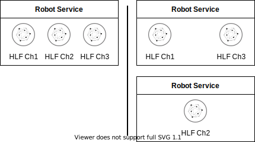

# Robot

[](https://goreportcard.com/report/github.com/anoideaopen/robot)
[](https://pkg.go.dev/github.com/anoideaopen/robot)


[](https://github.com/anoideaopen/robot/actions/workflows/go.yml)
[](https://github.com/anoideaopen/robot/actions/workflows/vulnerability-scan.yml)


## TOC
- [Robot](#robot)
  - [TOC](#toc)
  - [Description](#description)
  - [Architecture](#architecture)
    - [Robot service](#robot-service)
    - [Robot service without swaps](#robot-service-without-swaps)
    - [Robot's components](#robots-components)
  - [Scaling](#scaling)
  - [Setup dev environment](#setup-dev-environment)
  - [Dependencies](#dependencies)
  - [Build](#build)
    - [Go](#go)
  - [Configuration yaml file](#configuration-yaml-file)
    - [Logger configuration](#logger-configuration)
    - [Robots' configuration](#robots-configuration)
      - [initBlockNum](#initblocknum)
        - [Example 1:](#example-1)
  - [Connection profile](#connection-profile)
        - [Example 2:](#example-2)
  - [Run](#run)
  - [Tests](#tests)
    - [Unit tests](#unit-tests)
    - [Integration tests](#integration-tests)
  - [Autodoc](#autodoc)
  - [Metrics](#metrics)
  - [Metrics Detailed Description](#metrics-detailed-description)
    - [Alerts](#alerts)
    - [Robot Metrics](#robot-metrics)
    - [GRAFANA dashboard](#grafana-dashboard)
    - [Dashboard Sections](#dashboard-sections)
  - [Logging](#logging)
  - [Links](#links)
  - [License](#license)

## Description
Robot is a service that executes swapping and batching on the Testnet platform #robot#off#offchain#batch#swap#atomic#

------
## Architecture
### Robot service

### Robot service without swaps

### Robot's components


**Collector** receives events about new blocks from HLF.\
**Parser** extracts from HLF block only data for the specific channel. \
**ChRobot** orchestrates all other components.\
**Storage** stores numbers of last handled blocks. Used on start and recovery.\
**Batch** collects data whereas it's limits aren't achieved.\
**Executor** decides which HLF peers should receive created batch and send it to them.

------
## Scaling
Robot might be configured as a single service that handles all HLF channels or as multiple services each of them handles its own non-overlapping group of HLF channels.



It is possible to have more than one instance of robot service that handles the same HLF channel simultaneously during the deployment.


However, it is not recommended configuring robot services that works with the same HLF channels, due to the fact that state storage  uses optimistic lock that would allow only the one ChRobot to send created batch to avoid MVCC conflict.


------
## Setup dev environment
[Development environment](https://github.com/core/doc/-/tree/master/development_environment)

------
## Dependencies
- HLF
- Redis
- Vault (optional)

------
## Build

### Go
```shell
go build -ldflags="-X 'main.AppInfoVer={Version}'"
```

------
## Configuration yaml file
```yaml
# Example

# logger
logLevel: debug # values: error, warning, info, debug, trace
logType: lr-txt # values: std, lr-txt, lr-txt-dev, lr-json, lr-json-dev

# Web server port
# Endpoints:
# /info    - application info
# /metrics - prometheus metrics
# /healthz - liveness probe
# /readyz  - readiness probe
serverPort: 8080

# Fabric
profilePath: /path/to/Fabric/connection.yaml # path to Fabric connection profile
userName: backend                            # Fabric user

# Block parser configuration
txSwapPrefix: swaps                 # prefix of keys in HLF which store tx swaps
txMultiSwapPrefix: multi_swap       # prefix of keys in HLF which store tx multi swaps
txPreimagePrefix: batchTransactions # prefix of keys in HLF which store tx preimages

# Robots configuration
robots:
  - chName: fiat                    # channel for batches
    collectorsBufSize: 1            # buffer size of blockData
    src:                            # sources of transactions, swaps, multiswaps, keys of swaps and keys of multiswaps
      - chName: fiat
        initBlockNum: 1             # block number to start from
    execOpts:                       # robot execute options
      executeTimeout: 0s            # timeout of sending-executing a batch in HLF (duration of batchExecute). If it is empty it is used a value from the defaultRobotExecOpts

# Batch limits
delayAfterChRobotError: 3s  # delay after not unrecoverable channel error before retry run channel miner again
defaultBatchLimits:         # at least one of limits must be filled
  batchBlocksCountLimit: 10 # max blocks count in a batch
  batchLenLimit: 1000       # max number of transactions, swaps, multiswaps, keys of swaps and keys of multiswaps in a batch
  batchSizeLimit: 100000    # max batch size in bytes
  batchTimeoutLimit: 300ms  # max waiting time before generating a batch
  
# Robots execute options
defaultRobotExecOpts:
  executeTimeout: 0s            # default timeout of sending-executing a batch in the HLF (duration of batchExecute)

# Redis configuration
redisStor:
  dbPrefix: robot # Redis db prefix
  addr:           # Redis addresses
    - redis-6379:6379
    - redis-6380:6380
  password: secret # Redis password
  withTLS: true    # enable TLS for communication with Redis
  rootCAs: /path/to/ca1.pem,/path/to/ca2.pem # comma-separated root CA's certificates list for TLS with Redis

# Prometheus configuration
promMetrics:
  prefix: robot_ # Prometheus prefix
```

### Logger configuration
List of available `logLevel` values:
- error
- warning
- info
- debug
- trace

List of available `logType` values: 
- std
- lr-txt
- lr-txt-dev
- lr-json
- lr-json-dev

### Robots' configuration
#### initBlockNum
Due to the fact that the number of block
from which robot have to start might be in
`the storage (last successfully handled block)` and `config.yaml (robots->src->initBlockNum value)`
in different states
it is important to know how the robot makes choice between them:
- if the value for a channel presents only in the config the robot uses it
- if the values present in both the robot takes the largest

##### Example 1:
config.yaml:
```yaml
robots:
  - chName: fiat
    src:
    - chName: ch1
      initBlockNum: 50
    - chName: ch2
      initBlockNum: 100
    - chName: ch3
      initBlockNum: 0
    - chName: ch4
      initBlockNum: 0   
```
Storage:
```json
{
  "ch1": 75,
  "ch2": 75,
  "ch3": 75
}
```
Result:
```
ch1 starts from the 75 block      # 50 < 75
ch2 starts from the 100 block     # 75 < 100
ch3 starts from the 75 block      # 75 from the storage
ch4 starts from the 0 block       # 0 from config.yaml
```
------

## Connection profile
It is important to set reasonable timeouts in a connection profile
##### Example 2:
connection.yaml:
```yaml
name: basic-network
version: 1.0.0
client:
  organization: Testnet

  logging:
    level: info

  connection:
    timeout:
      peer:
        endorser: '300'
      orderer: '300'

  peer:
    timeout:
      response: 5s
      connection: 3s
      discovery:
        # Expiry period for discovery service greylist filter
        # The channel client will greylist peers that are found to be offline
        # to prevent re-selecting them in subsequent retries.
        # This interval will define how long a peer is greylisted
        greylistExpiry: 1s
      registrationResponse: 10s
    orderer:
      timeout:
        connection: 3s
        response: 5s
    global:
      timeout:
        query: 5s
        execute: 5s
        resmgmt: 5s
      cache:
        connectionIdle: 30s
        eventServiceIdle: 2m
        channelConfig: 60s
        channelMembership: 10s
        
  credentialStore:
    #...
  tlsCerts:
    #...

channels:
  #...
organizations:
  #...
orderers:
  #...
peers:
  #...
```
------

## Run
```shell
./robot -c=config.yaml
```
or
```shell
export ROBOT_CONFIG="config.yaml" && ./robot
```
or create file ```config.yaml``` next to the robot executable\
or create file ```/etc/config.yaml```

Also, it is possible to [override](https://github.com/spf13/viper#working-with-environment-variables) values from config by env variables with `ROBOT_` prefix
```shell
export ROBOT_REDISSTOR_PASSWORD=123456 &&
export ROBOT_VAULTCRYPTOSETTINGS_VAULTAUTHPATH="v1/auth/kubernetes/login" &&
./robot -c=config.yaml
```

------
## Tests
### Unit tests
```shell
# Run unit tests
go test ./... -short
```
### Integration tests
Setup [testing environment](https://github.com/anoideaopen/sandbox/blob/main/env-hlf-2.5.4)
```shell
# Run integration tests
export ROBOT_TEST_HLF_PROFILE="/path/to/connection.yaml" &&    # Path to the Fabric connection profile
export ROBOT_TEST_HLF_USER="User1" &&                          # Fabric user. Default: User1
export ROBOT_TEST_HLF_CERT="/path/to/cert.pem" &&              # Path to HLF cert. Takes credentialStore from the Fabric connection profile + {hlfUser}@{orgName}-cert.pem
export ROBOT_TEST_HLF_SK="/path/to/msp/keystore/9ac7152_sk" && # Path to HLF secret key. Takes cryptoStore from the Fabric connection profile + "keystore/priv_sk"
export ROBOT_TEST_HLF_FIAT_OWNER_KEY_BASE58CHECK="" &&         # Base58Check from fiat owner secret key
export ROBOT_TEST_HLF_CC_OWNER_KEY_BASE58CHECK=""  &&          # Base58Check from cc owner secret key
export ROBOT_TEST_HLF_INDUSTRIAL_OWNER_KEY_BASE58CHECK=""      # Base58Check from industrial owner secret key
export ROBOT_TEST_HLF_CH_FIAT="" &&                            # Fiat chaincode name
export ROBOT_TEST_HLF_CH_CC="" &&                              # Cc chaincode name
export ROBOT_TEST_HLF_CH_INDUSTRIAL="" &&                      # Industrial chaincode name
export ROBOT_TEST_HLF_CH_NO_CC="" &&                           # Channel without installed chaincodes for testing the robot service behaviour
export ROBOT_TEST_HLF_DO_SWAPS="false" &&                      # Whether run swap test scenarios. Default: false
export ROBOT_TEST_HLF_DO_MSWAPS="false" &&                     # Whether run multiswap test scenarios. Default: false
export ROBOT_TEST_HLF_INDUSTRIAL_GROUP1="" &&                  # Group for multiswap test scenarios
export ROBOT_TEST_HLF_INDUSTRIAL_GROUP2="" &&                  # Group for multiswap test scenarios
export ROBOT_TEST_REDIS_ADDR="127.0.0.1:6379" &&               # Redis address. Default: 127.0.0.1:6379
export ROBOT_TEST_REDIS_PASS="test" &&                         # Redis password. Default: test
go test ./... -p 1
```

------
## Autodoc
[doc/godoc/pkg/github.com/anoideaopen/robot/index.html](doc/godoc/pkg/github.com/anoideaopen/robot/index.html)

------
## Metrics
Metrics are available at `/metrics`\
The robot service provides these metrics:
- **go default metrics**
- **app_init_duration_seconds**\
  _gauge_, app init duration
- **app_info**\
  _counter_, app info, all sufficient payload is set through labels:\
  Labels:\
  _ver_ - app version (or hash commit) \
  _ver_sdk_fabric_ - sdk fabric version (or hash commit) with which the app was built \
  _build_date_ - build date
- **batches_executed_total**\
  _counter_, amount of executed batches\
  Labels:\
  _robot_ - robot's destination channel\
  _iserr_ - executed with error - true, false
- **tx_executed_total**\
  _counter_, amount of executed transactions (in all executed batches) \
  Labels:\
  _robot_ - robot's destination channel\
  _txtype_ - type of transaction - (tx, swap, mswap, swapkey, mswapkey)
- **batch_execute_duration_seconds**\
  _histogram_, time spent on sending-executing a batch in HLF (duration of batchExecute)\
  Labels:\
  _robot_ - robot's destination channel\
- **batch_size_estimated_diff**\
  _histogram_, relative difference between real and assumed batch size\
  Labels:\
  _robot_ - robot's channel
- **batch_size_bytes**\
  _histogram_, batch size\
  Labels:\
  _robot_ - robot's destination channel
- **batch_size_bytes_total**\
  _counter_, batch size\
  Labels:\
  _robot_ - robot's destination channel
- **ord_reqsize_exceeded_total**\
  _counter_, amount of times request size was exceeded during executeBatch\
  Labels:\
  _robot_ - robot's destination channel\
  _is_first_attempt_ - whether it is a first attempt or not - true, false 
- **src_channel_errors_total**\
  _counter_, amount of times there was an error on creating HLF events source\
  Labels:\
  _robot_ - robot's destination channel\
  _channel_ - robot's source channel\
  _is_first_attempt_ - whether it is a first attempt or not - true, false\
  _is_src_ch_closed_ - whether source channel was closed or not - true, false\
  _is_timeout_ - whether await timeout was reached - true, false
- **batch_tx_count**\
  _histogram_, total amount of transactions, swaps, multiswaps, keys of swaps and keys of multiswaps in a batch\
  Labels:\
  _robot_ - robot's channel
- **batch_collect_duration_seconds** \
  _histogram_, time spent on collecting a batch. Batch collects by asking collectors. Batch is ready when one of the batch limits on the number of transactions, size or timeout occurs\
  Labels:\
  _robot_ - robot's destination channel
- **tx_waiting_process_count**\
  _gauge_, amount of transactions (counts everything that is in a batch - transaction ids, swaps, multiswaps, keys of swaps and keys of multiswaps) awaiting execution when collector added them into a queue\
  Labels:\
  _robot_ - robot's destination channel\
  _channel_ - robot's source channel
- **height_ledger_blocks**\
  _gauge_, ledger's block num where batch was committed. Takes after every _executeBatch_\
  Labels:\
  _robot_ - robot's destination channel\
- **collector_process_block_num**\
  _gauge_, the block number processing by the collector\
  Labels:\
  _channel_ - robot's source channel\
  _robot_ - robot's destination channel
- **block_tx_count**\
  _histogram_, amount of transactions in a block\
  Labels:\
  _robot_ - robot's destination channel\
  _channel_ - robot's source channel
- **started_total**\
  _counter_, amount of times robot was started (it's main cycle) \
  Labels:\
  _robot_ - robot's destination channel
- **stopped_total**\
  _counter_, amount of times robot was stopped (it's main cycle) \
  Labels:\
  _robot_ - robot's destination channel \
  _iserr_ - executed with error - true, false \
  _err_type_ - error type on interaction with external system (HLF, Redis, etc.) In other case it is internal\
  _component_ - robot service's component (executor, collector, storage, etc.)

Most all the metrics are available on robot service start, but some metrics might be measured only during robot service work.\
These metrics are available after a batch was created and successfully sent to HLF:
- batch_execute_duration_seconds
- batch_size_estimated_diff
- batch_size_bytes
- batch_tx_count
- batch_collect_duration_seconds
- block_tx_count


## Metrics Detailed Description

Dashboard and alerting for monitoring of Robot service operation are implemented on the basis of Prometeus and Grafana systems.

The Robot service generates metrics data in the course of its operation.

Robot metrics data are received by Prometeus, where they are recorded in the database.
Prometeus also processes metrics data according to the rules defined for Robot.
In case of occurrence of situations defined by the rules, an alert about the event corresponding to the rule is made.

The Grafana system uses the Prometeus database data to generate metrics and dashboard graphs in the time retrospective.

### Alerts


### Robot Metrics

-1- **app\_init\_duration\_seconds**

Type: sensor

Indicator: duration of application initialization, the time in seconds it took to start the application

-2- **app\_info**

Type: counter; application information

Indicators:
- ver - application version (or hash commit)
- ver\_sdk\_fabric - sdk fabric version (or hash commit)
- build\_date - build date

-3-  **batches\_executed\_total**

Type: counter; number of packets processed broken down by destination channel and execution with/without errors.

Indicators:

- robot - robot destination channel
- iserr - executed with error - true, false

Description:

- The counter value should increase for at least some of the destination channels during site operations.

-4- **tx\_executed\_total**

Type: counter; the number of executed transactions (also swaps, multiswaps, swap keys and multiswaps) in all processed packets broken down by destination channel and transaction type.

Indicators:

- robot - robot destination channel
- txtype - transaction type

Description:

- The counter value should increase for at least some destination channels and transaction types when transactions are performed on the site.

-5- **batch\_execute\_duration\_seconds**

Type: histogram; time taken to send-execute a packet in HLF (broken down by channel)

Indicators:

- robot - robot destination channel

-6- **batch\_size\_estimated\_diff**

Type: histogram; relative difference between actual and estimated packet size

Indicators:

- robot - robot channel

Description:

- When a packet is serialized into a protobuf, its size is increased. Preliminary estimation of the increase can be done in two ways. In the first case, each time a transaction (swap, etc.) is added to the packet, serialization is performed and the size after serialization is determined. But this method is rather costly. The second, more economical way is to use a special method in protobuf to estimate the size of the whole package immediately after serialization. The metric shows the difference between the results of the two methods.

-7- **batch\_size\_bytes**

Type: histogram; packet size in bytes by destination channel.

Indicators:

- robot - robot destination channel

-8- **batch\_size\_bytes\_total**

Type: counter; total volume of processed packets at the current moment of time by destination channel (current sum of **batch\_size\_bytes** values).

Indicators:

- robot - robot destination channel

-9- **ord\_reqsize\_exceeded\_total**

Type: counter; number of request size exceedances during batch execution (batch)

Indicators:

- robot - the destination channel of the robot
- is\_first\_attempt - whether this is the first attempt or not - true, false

Description:

- The robot types transactions into packets (batch). A batch is formed either by timeout, maximum size or maximum number of transactions, swaps.
- The batch is sent to the orderers, which return an rw-set, the size of which is not known in advance. If the size of the rw-set exceeds the maximum size allowed by fabric (fabric parameter), an error is received in the response from the fabric sdk. In this case, the package is split in half and the resulting parts are executed separately.
- At each such split the counter value is increased by one. There may be a situation when several splits are needed to process a packet. For each of them the counter is incremented.
- The counter is reset when the robot is restarted. "Fluctuating" counter value (increasing by one over a long period of time) is normal. A noticeable monotonic increase in the value over a short period of time should cause attention.

-10-  **src\_channel\_errors\_total**

Type: counter; number of errors when creating the HLF event source

Indicators:

- robot - robot destination channel
- channel - the source channel of the robot
- is\_first\_attempt - whether this is the first attempt or not - true, false
- is\_src\_ch\_closed - whether the source channel was closed or not - true, false
- is\_timeout - whether timeout was reached or not - true, false

Description:

- The "collector" components of the robot service subscribe to their designated channels to analyze channel events, which then provides for batch (batch) generation. During subscription creation, there may be collisions (fabric unavailable or misconfigured, cryptographic inconsistencies, network failures, etc.) that cause the collector to fail to subscribe to the events of the channel it serves.
- Each unsuccessful subscription attempt increases the value of the metric counter. A different counter is kept for each collector.
- It is recorded whether the subscription attempt of the corresponding collector was the first or not.
- The counters are reset when the robot is restarted. "Fluctuating" counter values (increasing by one over an extended period of time) are normal. A noticeable monotonic increase in the value over a short period of time should cause attention.

-11- **batch\_tx\_count**

Type: histogram; total number of transactions, swaps, multi-swaps, swap keys and multi-swap keys for each packet by destination channel.

Indicators:

- robot - robot channel

-12- **batch\_collect\_duration\_seconds**

Type: histogram; time taken to form a packet. Calculated for each packet.

Indicators:

- robot - robot destination channel

Description:

- Completion of packet formation is done either when a timeout occurs, when the maximum packet size is reached, or when the maximum number of transactions for a packet is reached. The time taken to form the packet is recorded.

-13- **tx\_waiting\_process\_count**

Type: sensor; number of transactions (transactions, swaps, multi-swaps, swap keys, and multi-swap keys are counted) waiting to be executed

Indicators:
- robot - robot destination channel
- channel - robot source channel

Description:

- A generated packet is not sent for execution immediately upon completion of formation, but after the previous packet has finished processing. The number of transactions waiting for execution is recorded in the metric. A growing queue of pending transactions may indicate problems.

-14- **height\_ledger\_blocks**

Type: sensor; number of the register block where the batch was committed, by destination channel. Formed after each **executeBatch**

Indicators:
- robot - robot destination channel

Description:

- The block number in ledger returned by the SDK after the packet is sent for execution. Block number values should only be incremental.

-15- **collector\_process\_block\_num**

Type: sensor; the current block number processed by the collector during packet generation

Indicators:

- robot - robot destination channel
- channel - robot source channel

-16- **block\_tx\_count**

Type: histogram; number of transactions per block

Indicators:

- robot - robot destination channel
- channel - robot source channel

Description:

- The number of transactions in the current block processed by the collector.  Analytical indicator that allows to determine whether several packets are formed from one block or, on the contrary, one packet is formed from several blocks based on comparison with **batch\_tx\_count** values.

-17- **started\_total**

Type: counter; number of robot starts (main cycle) by destination channel.

Indicators:

- robot - robot destination channel

Description:

- An increase in the number of robot starts in any channel(s) may indicate problems.

-18- **stopped\_total**

Type: counter; number of robot stops (basic cycle)

Indicators:

- robot - robot destination channel
- iserr - executed with error - true, false
- err\_type - type of error when interacting with an external system (HLF, Redis, etc.)
- component - component of the robot service (executor, collector, storage, etc.).

Description:

- Metrics allow you to analyze the causes of service outages.

Most metrics are available when the robot service is started, but some metrics can only be measured while the robot service is running.
These metrics are available after a package has been created and successfully sent to the HLF:

-   batch\_execute\_duration\_seconds
-   batch\_size\_estimated\_diff
-   batch\_size\_bytes
-   batch\_tx\_count
-   batch\_collect\_duration\_seconds
-   block\_tx\_count

### GRAFANA dashboard

The Grafana system displaying the dashboard is logged in at


After logging in, select the Default folder in the Dashboards menu (Fig. 1), and in it - the NewRobot dashboard. and in it - NewRobot dashboard.

Fig. 1. Dashboards menu. Select the NewRobot dashboard

After selecting the NewRobot dashboard, you are passed to the dashboard window (Fig. 2)


Fig. 2. General view of the NewRobot dashboard

In the upper right corner of the dashboard there is a control block (Fig. 3), which provides updating of the dashboard content (two circular arrows), as well as setting (two drop-down menus) of the dashboard update interval (right menu) and data display period (left menu).


Fig. 3: Data display mode control unit

### Dashboard Sections


Figure 4. Dashboard sections, fragment 1

Dashboard sections are described according to their arrangement (Fig. 3) in rows from left to right, with the transition through the rows from top to bottom. The overall view of the dashboard in Figure 3 is broken down into three enlarged fragments in Figs. 4 - 6. The description of each section indicates the figure that reflects the section and the number corresponding to the metric in the Robot Metrics paragraph

**App Init Duration Seconds**

Figure: 4

Metric No.: 1

Description: duration of Robot initialization in seconds

**App Info**

Figure: 4

Metric No.: 2

Description: data about the Robot service, including ver is the version of the Robot service, ver\_sdk\_fabrik is the version of the Fabric SDK

**Height Ledger Blocks**

Figure: 4

Metric No.: 14

Description: for channels processed by the Robot service, the number of the blockchain block in which the last packet was successfully processed (in Fig. 4 pairs: ct - 0, dc - 0, dcdac - 106282, dcgmk - 0, dcrsb - 0, fiat - 0, hermitage - 640,...)

**Started**

Figure: 4

Metric No.: 17

Description: number of Robot subsystem runs for channels handled by the service (in Fig. 4 pairs: ct - 1, dc - 1, dcdac - 2, dcgmk - 1, dcrsb - 1, fiat - 1, hermitage - 1,...)

**Stopped without errors**

Figure: 4

Metric No.: 18

Description: number of stops of Robot subsystems without error (iserr=false) for channels handled by the service (in Figure 4 pairs: ct - 0, dc - 0, dcdac - 0,...)

**Stopped with errors**

Figure: 4

Metric No.: 18

Description: number of Robot subsystems stops with an error (iserr=true) for channels handled by the service (in Figure 4 pairs: ct - 0, dc - 0, dcdac - 0,...)

**Amount of executed transactions (in all executed batches)**

Figure: 4

Metric No.: 4

Description: average number of executed transactions per time interval (in all executed packets)

**Collector process block num**

Figure: 4

Metric No.: 15

Description: average number of blocks processed by the collector per time interval (in all executed packets)


Figure 5. Dashboard sections, fragment 2

The dashboard sections described below represent data in the form of histograms/graphs depending on time.
To obtain the exact values of parameters for a given moment of time for all such views, it is necessary to place the mouse cursor at a given point on the view.
After that, a form with exact values of parameters for the given moment of time appears.
An example of such refinement is given below for the section **Block Tx Count 95 percentille** (Fig. 6)

**Block Tx Count 95 percentille**

Figure: 5

Metric No.: 16

Description: the value of the 95th percentile of the number of transactions per block for channels processed by the Robot service

Comment: when the mouse cursor is placed over the histogram, a form with the exact values for the given moment of time appears (Fig. 6)


Figure 6. Determination of exact values for channels on the histogram 

**Block Tx Count 95 percentille**

**TX waiting process count**

Figure: 5

Metric No.: 13

Description: the number of transactions (everything in the packet is counted - transaction IDs, swaps, multi-exchanges, swap keys and multi-use keys) waiting to be executed after being added to the queue by the collector (robot is the destination channel, channel is the source channel).

**Batch size total**

Figure: 5

Metric No.: 8

Description: packet size by destination channel

**Batches executed total**

Figure: 5

Metric No.: 3

Description: interval-averaged number of packets processed on destination channels without errors, iserr=false

**Batches executed errors**

Figure: 5

Metric No.: 3

Description: interval-averaged number of packets processed on destination channels with errors, iserr=true


Figure 7. Dashboard sections, fragment 3

**Batch Collect Duration Seconds 95 percentille**

Figure: 7

Metric No.: 12

Description: the value of the 95th percentile of the time taken to collect the packet.
A packet is collected by polling the collectors.
A packet is ready when one of the packet's constraints on number of transactions, size, or timeout is met

**Batch execute duration seconds 95 percentille**

Figure: 7

Metric No.: 5

Description: the value of the 95th percentile of the time taken to send-execute a packet in HLF

**Batch Size 95 percentille**

Figure: 7

Metric No.: 7

Description: the value of the 95th percentile packet size for a given robot destination channel

**Batch Size Estimated Diff 95 percentille**

Figure: 7

Metric No.: 6

Description: the 95th percentile value of the relative difference between the actual and estimated packet sizes for a given robot destination channel

**Batch Size TX count 95 percentille**

Figure: 7

Metric No.: 11

Description: the 95th percentile value of the total number of transactions, swaps, multi-swaps, swap keys, and multi-swap keys in a packet for a given robot destination channel

## Logging

[Logging documentation](doc/logging.md)

## Links
## License
Apache-2.0
