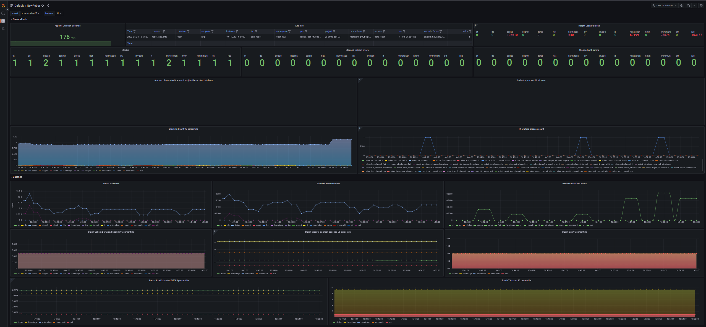

# Robot

## TOC
- [Robot](#robot)
  - [TOC](#toc)
  - [Description](#description)
  - [Architecture](#architecture)
    - [Robot service](#robot-service)
    - [Robot service without swaps](#robot-service-without-swaps)
    - [Robot's components](#robots-components)
  - [Scaling](#scaling)
  - [Setup dev environment](#setup-dev-environment)
  - [Dependencies](#dependencies)
  - [Build](#build)
    - [Go](#go)
    - [Docker](#docker)
  - [Configuration yaml file](#configuration-yaml-file)
    - [Logger configuration](#logger-configuration)
    - [Robots' configuration](#robots-configuration)
      - [initBlockNum](#initblocknum)
        - [Example 1:](#example-1)
  - [Connection profile](#connection-profile)
        - [Example 2:](#example-2)
  - [Run](#run)
  - [Tests](#tests)
    - [Unit tests](#unit-tests)
    - [Integration tests](#integration-tests)
  - [Autodoc](#autodoc)
  - [Metrics](#metrics)
  - [Metrics Detailed Description](#metrics-detailed-description)
    - [Alerts](#alerts)
    - [Robot Metrics](#robot-metrics)
    - [GRAFANA dashboard](#grafana-dashboard)
    - [Dashboard Sections](#dashboard-sections)
  - [Logging](#logging)
  - [Links](#links)
  - [License](#license)

## Description
Robot is a service that executes swapping and batching on the Testnet platform #robot#off#offchain#batch#swap#atomic#

------
## Architecture
### Robot service

### Robot service without swaps

### Robot's components


**Collector** receives events about new blocks from HLF.\
**Parser** extracts from HLF block only data for the specific channel. \
**ChRobot** orchestrates all other components.\
**Storage** stores numbers of last handled blocks. Used on start and recovery.\
**Batch** collects data whereas it's limits aren't achieved.\
**Executor** decides which HLF peers should receive created batch and send it to them.

------
## Scaling
Robot might be configured as a single service that handles all HLF channels or as multiple services each of them handles its own non-overlapping group of HLF channels.


It is possible to have more than one instance of robot service that handles the same HLF channel simultaneously during the deployment.


However, it is not recommended configuring robot services that works with the same HLF channels, due to the fact that state storage  uses optimistic lock that would allow only the one ChRobot to send created batch to avoid MVCC conflict.


------
## Setup dev environment
[Development environment](https://github.com/core/doc/-/tree/master/development_environment)

------
## Dependencies
- HLF
- Redis
- Vault (optional)

------
## Build

### Go
```shell
go build -ldflags="-X 'main.AppInfoVer={Version}'"
```
### Docker
To build docker image you need to provide a `REGISTRY_NETRC` build-arg (to fetch go modules from private registry).
You need to replace in the command below `GITLAB_USERNAME` with your github.com username and `GITLAB_API_KEY` with
your gitlab access token, generated on [personal access tokens page](https://github.com/-/profile/personal_access_tokens)
(token should have the `read_repository` permission).
```shell
docker build \
  --platform linux/amd64 \
  --build-arg REGISTRY_NETRC="machine github.com login GITLAB_USERNAME password GITLAB_API_KEY" \
  .
```
Base build image can be overridden with `BUILDER_IMAGE` (default `golang`) and `BUILDER_VERSION` (default `1.18-alpine`). Sometimes it may be useful in
CI environments.

------
## Configuration yaml file
```yaml
# Example

# logger
logLevel: debug # values: error, warning, info, debug, trace
logType: lr-txt # values: std, lr-txt, lr-txt-dev, lr-json, lr-json-dev

# Web server port
# Endpoints:
# /info    - application info
# /metrics - prometheus metrics
# /healthz - liveness probe
# /readyz  - readiness probe
serverPort: 8080

# Fabric
profilePath: /path/to/Fabric/connection.yaml # path to Fabric connection profile
userName: backend                            # Fabric user

# Block parser configuration
txSwapPrefix: swaps                 # prefix of keys in HLF which store tx swaps
txMultiSwapPrefix: multi_swap       # prefix of keys in HLF which store tx multi swaps
txPreimagePrefix: batchTransactions # prefix of keys in HLF which store tx preimages

# Robots configuration
robots:
  - chName: fiat                    # channel for batches
    collectorsBufSize: 1            # buffer size of blockData
    src:                            # sources of transactions, swaps, multiswaps, keys of swaps and keys of multiswaps
      - chName: fiat
        initBlockNum: 1             # block number to start from
    execOpts:                       # robot execute options
      executeTimeout: 0s            # timeout of sending-executing a batch in HLF (duration of batchExecute). If it is empty it is used a value from the defaultRobotExecOpts

# Batch limits
delayAfterChRobotError: 3s  # delay after not unrecoverable channel error before retry run channel miner again
defaultBatchLimits:         # at least one of limits must be filled
  batchBlocksCountLimit: 10 # max blocks count in a batch
  batchLenLimit: 1000       # max number of transactions, swaps, multiswaps, keys of swaps and keys of multiswaps in a batch
  batchSizeLimit: 100000    # max batch size in bytes
  batchTimeoutLimit: 300ms  # max waiting time before generating a batch
  
# Robots execute options
defaultRobotExecOpts:
  executeTimeout: 0s            # default timeout of sending-executing a batch in the HLF (duration of batchExecute)

# Redis configuration
redisStor:
  dbPrefix: robot # Redis db prefix
  addr:           # Redis addresses
    - redis-6379:6379
    - redis-6380:6380
  password: secret # Redis password
  withTLS: true    # enable TLS for communication with Redis
  rootCAs: /path/to/ca1.pem,/path/to/ca2.pem # comma-separated root CA's certificates list for TLS with Redis

# Crypto configuration
cryptoSrc: vault # values: local, vault, google
vaultCryptoSettings: # HashiCorp Vault configuration
  vaultToken: 123                     # access token for Vault
  useRenewableVaultTokens: false
  vaultAddress: http://localhost:8200 # Vault instance address
  vaultAuthPath:                      # to which endpoint to send requests to get a temporary Vault token
  vaultRole:                          # Vault role
  vaultServiceTokenPath:              # path to the token file for accessing the k8s
  vaultNamespace: kv/                 # directory where all crypto materials are located in Vault
  userCert: backend@MSP-cert.pem # Fabric user's cert
googleCryptoSettings: # Google KMS configuration
  gcloudProject: # GCloud project ID
  gcloudCreds:   # path to GCloud credentials
  userCert:      # Fabric user's cert

# Prometheus configuration
promMetrics:
  prefix: robot_ # Prometheus prefix
```

### Logger configuration
List of available `logLevel` values:
- error
- warning
- info
- debug
- trace

List of available `logType` values: 
- std
- lr-txt
- lr-txt-dev
- lr-json
- lr-json-dev

### Robots' configuration
#### initBlockNum
Due to the fact that the number of block
from which robot have to start might be in
`the storage (last successfully handled block)` and `config.yaml (robots->src->initBlockNum value)`
in different states
it is important to know how the robot makes choice between them:
- if the value for a channel presents only in the config the robot uses it
- if the values present in both the robot takes the largest

##### Example 1:
config.yaml:
```yaml
robots:
  - chName: fiat
    src:
    - chName: ch1
      initBlockNum: 50
    - chName: ch2
      initBlockNum: 100
    - chName: ch3
      initBlockNum: 0
    - chName: ch4
      initBlockNum: 0   
```
Storage:
```json
{
  "ch1": 75,
  "ch2": 75,
  "ch3": 75
}
```
Result:
```
ch1 starts from the 75 block      # 50 < 75
ch2 starts from the 100 block     # 75 < 100
ch3 starts from the 75 block      # 75 from the storage
ch4 starts from the 0 block       # 0 from config.yaml
```
------

## Connection profile
It is important to set reasonable timeouts in a connection profile
##### Example 2:
connection.yaml:
```yaml
name: basic-network
version: 1.0.0
client:
  organization: Testnet

  logging:
    level: info

  connection:
    timeout:
      peer:
        endorser: '300'
      orderer: '300'

  peer:
    timeout:
      response: 5s
      connection: 3s
      discovery:
        # Expiry period for discovery service greylist filter
        # The channel client will greylist peers that are found to be offline
        # to prevent re-selecting them in subsequent retries.
        # This interval will define how long a peer is greylisted
        greylistExpiry: 1s
      registrationResponse: 10s
    orderer:
      timeout:
        connection: 3s
        response: 5s
    global:
      timeout:
        query: 5s
        execute: 5s
        resmgmt: 5s
      cache:
        connectionIdle: 30s
        eventServiceIdle: 2m
        channelConfig: 60s
        channelMembership: 10s
        
  credentialStore:
    #...
  tlsCerts:
    #...

channels:
  #...
organizations:
  #...
orderers:
  #...
peers:
  #...
```
------

## Run
```shell
./robot -c=config.yaml
```
or
```shell
export ROBOT_CONFIG="config.yaml" && ./robot
```
or create file ```config.yaml``` next to the robot executable\
or create file ```/etc/config.yaml```

Also, it is possible to [override](https://github.com/spf13/viper#working-with-environment-variables) values from config by env variables with `ROBOT_` prefix
```shell
export ROBOT_REDISSTOR_PASSWORD=123456 &&
export ROBOT_VAULTCRYPTOSETTINGS_VAULTAUTHPATH="v1/auth/kubernetes/login" &&
./robot -c=config.yaml
```

------
## Tests
### Unit tests
```shell
# Run unit tests
go test ./... -short
```
### Integration tests
Setup [testing environment](https://github.com/anoideaopen/sandbox/blob/main/env-hlf-2.5.4)
```shell
# Run integration tests
export ROBOT_TEST_HLF_PROFILE="/path/to/connection.yaml" &&    # Path to the Fabric connection profile
export ROBOT_TEST_HLF_USER="User1" &&                          # Fabric user. Default: User1
export ROBOT_TEST_HLF_CERT="/path/to/cert.pem" &&              # Path to HLF cert. Takes credentialStore from the Fabric connection profile + {hlfUser}@{orgName}-cert.pem
export ROBOT_TEST_HLF_SK="/path/to/msp/keystore/9ac7152_sk" && # Path to HLF secret key. Takes cryptoStore from the Fabric connection profile + "keystore/priv_sk"
export ROBOT_TEST_HLF_FIAT_OWNER_KEY_BASE58CHECK="" &&         # Base58Check from fiat owner secret key
export ROBOT_TEST_HLF_CC_OWNER_KEY_BASE58CHECK=""  &&          # Base58Check from cc owner secret key
export ROBOT_TEST_HLF_INDUSTRIAL_OWNER_KEY_BASE58CHECK=""      # Base58Check from industrial owner secret key
export ROBOT_TEST_HLF_CH_FIAT="" &&                            # Fiat chaincode name
export ROBOT_TEST_HLF_CH_CC="" &&                              # Cc chaincode name
export ROBOT_TEST_HLF_CH_INDUSTRIAL="" &&                      # Industrial chaincode name
export ROBOT_TEST_HLF_CH_NO_CC="" &&                           # Channel without installed chaincodes for testing the robot service behaviour
export ROBOT_TEST_HLF_DO_SWAPS="false" &&                      # Whether run swap test scenarios. Default: false
export ROBOT_TEST_HLF_DO_MSWAPS="false" &&                     # Whether run multiswap test scenarios. Default: false
export ROBOT_TEST_HLF_INDUSTRIAL_GROUP1="" &&                  # Group for multiswap test scenarios
export ROBOT_TEST_HLF_INDUSTRIAL_GROUP2="" &&                  # Group for multiswap test scenarios
export ROBOT_TEST_REDIS_ADDR="127.0.0.1:6379" &&               # Redis address. Default: 127.0.0.1:6379
export ROBOT_TEST_REDIS_PASS="test" &&                         # Redis password. Default: test
go test ./... -p 1
```

------
## Autodoc
[doc/godoc/pkg/github.com/anoideaopen/robot/index.html](doc/godoc/pkg/github.com/anoideaopen/robot/index.html)

------
## Metrics
Metrics are available at `/metrics`\
The robot service provides these metrics:
- **go default metrics**
- **app_init_duration_seconds**\
  _gauge_, app init duration
- **app_info**\
  _counter_, app info, all sufficient payload is set through labels:\
  Labels:\
  _ver_ - app version (or hash commit) \
  _ver_sdk_fabric_ - sdk fabric version (or hash commit) with which the app was built \
  _build_date_ - build date
- **batches_executed_total**\
  _counter_, amount of executed batches\
  Labels:\
  _robot_ - robot's destination channel\
  _iserr_ - executed with error - true, false
- **tx_executed_total**\
  _counter_, amount of executed transactions (in all executed batches) \
  Labels:\
  _robot_ - robot's destination channel\
  _txtype_ - type of transaction - (tx, swap, mswap, swapkey, mswapkey)
- **batch_execute_duration_seconds**\
  _histogram_, time spent on sending-executing a batch in HLF (duration of batchExecute)\
  Labels:\
  _robot_ - robot's destination channel\
- **batch_size_estimated_diff**\
  _histogram_, relative difference between real and assumed batch size\
  Labels:\
  _robot_ - robot's channel
- **batch_size_bytes**\
  _histogram_, batch size\
  Labels:\
  _robot_ - robot's destination channel
- **batch_size_bytes_total**\
  _counter_, batch size\
  Labels:\
  _robot_ - robot's destination channel
- **ord_reqsize_exceeded_total**\
  _counter_, amount of times request size was exceeded during executeBatch\
  Labels:\
  _robot_ - robot's destination channel\
  _is_first_attempt_ - whether it is a first attempt or not - true, false 
- **src_channel_errors_total**\
  _counter_, amount of times there was an error on creating HLF events source\
  Labels:\
  _robot_ - robot's destination channel\
  _channel_ - robot's source channel\
  _is_first_attempt_ - whether it is a first attempt or not - true, false\
  _is_src_ch_closed_ - whether source channel was closed or not - true, false\
  _is_timeout_ - whether await timeout was reached - true, false
- **batch_tx_count**\
  _histogram_, total amount of transactions, swaps, multiswaps, keys of swaps and keys of multiswaps in a batch\
  Labels:\
  _robot_ - robot's channel
- **batch_collect_duration_seconds** \
  _histogram_, time spent on collecting a batch. Batch collects by asking collectors. Batch is ready when one of the batch limits on the number of transactions, size or timeout occurs\
  Labels:\
  _robot_ - robot's destination channel
- **tx_waiting_process_count**\
  _gauge_, amount of transactions (counts everything that is in a batch - transaction ids, swaps, multiswaps, keys of swaps and keys of multiswaps) awaiting execution when collector added them into a queue\
  Labels:\
  _robot_ - robot's destination channel\
  _channel_ - robot's source channel
- **height_ledger_blocks**\
  _gauge_, ledger's block num where batch was committed. Takes after every _executeBatch_\
  Labels:\
  _robot_ - robot's destination channel\
- **collector_process_block_num**\
  _gauge_, the block number processing by the collector\
  Labels:\
  _channel_ - robot's source channel\
  _robot_ - robot's destination channel
- **block_tx_count**\
  _histogram_, amount of transactions in a block\
  Labels:\
  _robot_ - robot's destination channel\
  _channel_ - robot's source channel
- **started_total**\
  _counter_, amount of times robot was started (it's main cycle) \
  Labels:\
  _robot_ - robot's destination channel
- **stopped_total**\
  _counter_, amount of times robot was stopped (it's main cycle) \
  Labels:\
  _robot_ - robot's destination channel \
  _iserr_ - executed with error - true, false \
  _err_type_ - error type on interaction with external system (HLF, Redis, etc.) In other case it is internal\
  _component_ - robot service's component (executor, collector, storage, etc.)

Most all the metrics are available on robot service start, but some metrics might be measured only during robot service work.\
These metrics are available after a batch was created and successfully sent to HLF:
- batch_execute_duration_seconds
- batch_size_estimated_diff
- batch_size_bytes
- batch_tx_count
- batch_collect_duration_seconds
- block_tx_count


## Metrics Detailed Description

Дашборд  и алертинг для мониторинга функционирования сервиса Robot
реализованы на базе систем Prometeus и Grafana.

Сервис Robot формирует в ходе своего функционирования данные метрик.

Данные метрик Robot поступают в  Prometeus, где они фиксируются в базе
данных. При этом Prometeus также производит обработку данных метрик по
правилам, заданным для Robot. В случае наступления определенных
правилами ситуаций производится оповещение (алерт) о соответствующем
правилу событии.

Система Grafana использует данные базы Prometeus для формирования
показателей и графиков дашборда во временной ретроспективе.

### Alerts


### Robot Metrics

-1- **app\_init\_duration\_seconds**

Тип: датчик

Показатель: продолжительность инициализации приложения, время в секундах, потребовавшееся для старта приложения

-2- **app\_info**

Тип: счетчик; информация о приложении

Показатели:
-   ver - версия приложения (или фиксация хэша)
-   ver\_sdk\_fabric - версия sdk fabric (или хэш-коммит)
-   build\_date - дата сборки

-3-  **batches\_executed\_total**

Тип: счетчик; количество обработанных пакетов в разрезе по каналам
назначения и выполнению с ошибками/без ошибок.

Показатели:

-   robot - канал назначения робота
-   iserr – выполнено с ошибкой - true, false

Описание:

-   При проведении операций на площадке значение счетчика должно увеличиваться хотя бы для некоторых каналов назначения.

-4- **tx\_executed\_total**

Тип: счетчик; количество исполненных транзакций (также свопов,
мультисвопов, ключей свопов и мультисвопов) во всех обработанных пакетах
в разрезе по каналам назначения и типам транзакций.

Показатели:

-   robot - канал назначения робота
-   txtype - тип транзакции

Описание:

-   При проведении операций на площадке значение счетчика должно увеличиваться хотя бы для некоторых каналов назначения и типов транзакций.

-5- **batch\_execute\_duration\_seconds**

Тип: гистограмма; время, затраченное на отправку-выполнение пакета в HLF
(в разбивке по каналам)

Показатели:

-   robot - канал назначения робота

-6- **batch\_size\_estimated\_diff**

Тип: гистограмма; относительная разница между реальным и предполагаемым
размерами пакета

Показатели:

-   robot - канал робота

Описание:

-   При сериализации пакета в protobuff его размер его увеличивается. Предварительную оценку увеличения можно провести двумя способами. В первом случае при каждом добавлении транзакции (свопа и пр.) в пакет проводится сериализация и определяется размер после     сериализации. Но этот способ достаточно затратен. Второй, более экономный способ заключается в использовании для оценки специального метода в protobuff, позволяющего определить размер всего пакета сразу после сериализации. Метрика показывает разницу      между результатами двух методов.

-7- **batch\_size\_bytes**

Тип: гистограмма; размер пакета в байтах в разрезе по каналам
назначения.

Показатели:

-   robot - канал назначения робота

-8- **batch\_size\_bytes\_total**

Тип: счетчик; общий объем обработанных пакетов на текущий момент времени
в разрезе по каналам назначения (текущая сумма значений
**batch\_size\_bytes**).

Показатели:

-   robot - канал назначения робота

-9- **ord\_reqsize\_exceeded\_total**

Тип: счетчик; число превышений размера запроса во время выполнения
пакета (batch)

Показатели:

-   robot - канал назначения робота
-   is\_first\_attempt - является ли это первой попыткой или нет - true, false

Описание:

-   Робот набирает транзакции в пакеты (batch). Пакет формируется либо по таймауту, либо по максимальному размеру, либо по максимальному количеству транзакциий, свапов.
-   Пакет отправляется ордерерам, которые возвращают rw-set, размер которого заранее неизвестен. Если размер rw-set превышает максимально допускаемый fabric размер (параметр fabric), то в ответе от fabric sdk приходит ошибка. В этом случае пакет делится пополам и полученные части выполняются по отдельности.
-   При каждом таком дроблении значение счетчика увеличивается на единицу. Возможна ситуация, когда для обработки пакета понадобится несколько дроблений. Для каждого из них счетчик инкрементируется.
-   Счетчик обнуляется при рестарте робота. "Флуктуирующее" значение счетчика (рост на единицу за продолжительное время) является нормальным. Внимание должен вызывать заметный монотонный рост значения за небольшой промежуток времени.

-10-  **src\_channel\_errors\_total**

Тип: счетчик; количество ошибок при создании источника событий HLF

Показатели:

-   robot - канал назначения робота
-   channel - исходный канал робота
-   is\_first\_attempt - является ли это первой попыткой или нет - true, false
-   is\_src\_ch\_closed - был ли исходный канал закрыт или нет - true, false
-   is\_timeout - был ли достигнут тайм-аут - true, false

Описание:

-   Компоненты «коллектор», входящие в состав службы робота, подписываются на предназначенные им каналы для анализа событий в каналах, что обеспечивает затем формирование пакетов (batch). При создании подписки возможны коллизии (fabric недоступен или неверно сконфигурирован, несогласованность в криптографии, сбои сети и пр.), из-за которых коллектору не удается подписаться на события обслуживаемого им канала.
-   Каждая неудачная попытка подписки увеличивает значение счетчика метрики. При этом для каждого коллектора ведется свой счетчик.
-   Фиксируется, была ли попытка подписки соответствующего коллектора первой или нет.
-   Счетчики обнуляются при рестарте робота. "Флуктуирующее" значение счетчика (рост на единицу за продолжительное время) является нормальным. Внимание должен вызывать заметный монотонный рост значения за небольшой промежуток времени.

-11- **batch\_tx\_count**

Тип: гистограмма; суммарное количество транзакций, свопов,
мульти-свопов, ключей свопов и ключей мультисвопов для каждого пакета в
разрезе по каналам назначения.

Показатели:

-   robot - канал робота

-12- **batch\_collect\_duration\_seconds**

Тип: гистограмма; время, затраченное на формирование пакета. Вычисляется
для каждого пакета.

Показатели:

-   robot - канал назначения робота

Описание:

-   Завершение формирования пакета производится либо по наступлению таймаута, либо по достижению максимального объема пакета, либо по достижению максимального количества транзакций для пакета. Фиксируется время, затраченное на формирование пакета.

-13- **tx\_waiting\_process\_count**

Тип: датчик; количество транзакций (учитываются транзакции, свопы,
мульти-свопы, ключи свопов и ключи мультисвопов), ожидающих выполнения

Показатели:
-   robot - канал назначения робота
-   channel - исходный канал робота

Описание:

-   Сформированный пакет передается на выполнение не сразу по завершении формирования, а после окончания обработки предыдущего пакета. Число транзакций, ожидающих выполнения, фиксируется в метрике. Рост очереди ожидающих выполнения транзакций может свидетельствовать о проблемах.

-14- **height\_ledger\_blocks**

Тип: датчик; номер блока реестра, в котором был зафиксирован пакет, в
разрезе каналов назначения. Формируется после каждого **executeBatch**

Показатели:
-   robot - канал назначения робота
  
Описание:

-   Номер блока в ledger, возвращаемый SDK после отправки пакета на исполнение. Значений номеров блоков должны только возрастать.

-15- **collector\_process\_block\_num**

Тип: датчик; текущий номер блока, обрабатываемый коллектором в ходе
формирования пакета

Показатели:

-   robot - канал назначения робота
-   channel - исходный канал робота

-16- **block\_tx\_count**

Тип: гистограмма; количество транзакций в блоке

Показатели:

-   robot - канал назначения робота
-   channel - исходный канал робота

Описание:

- Количество транзакций в текущем блоке, обрабатываемом коллектором.  Аналитический показатель, позволяющий на основе сравнения со значениями **batch\_tx\_count**  установить, формируется ли несколько пакетов из одного блока, или, напротив, один пакет из нескольких блоков.

-17- **started\_total**

Тип: счетчик; количество запусков робота (основной цикл) в разрезе по
каналам назначения.

Показатели:

-   robot - канал назначения робота

Описание:

-   Рост числа запусков робота в каком-либо канале (каналах) может свидетельствовать о проблемах.

-18- **stopped\_total**

Тип: счетчик; количество остановок робота (основной цикл)

Показатели:

-   robot - канал назначения робота
-   iserr - выполняется с ошибкой - true, false
-   err\_type - тип ошибки при взаимодействии с внешней системой (HLF, Redis и т.д.)
-   component - компонент службы робота (executor, collector, storage, etc.)

Описание:

-   Показатели позволяют проанализировать причины остановок службы.

Большинство метрик доступно при запуске службы робота, но некоторые
метрики могут быть измерены только во время работы службы робота. Эти
метрики доступны после создания пакета и успешной отправки в HLF:

-   batch\_execute\_duration\_seconds
-   batch\_size\_estimated\_diff
-   batch\_size\_bytes
-   batch\_tx\_count
-   batch\_collect\_duration\_seconds
-   block\_tx\_count

### GRAFANA dashboard

Вход в систему Grafana, отображающую дашборд, производится по адресу


После
входа необходимо выбрать в меню Dashboards (рис. 1) папку Default, а в
ней - дашборд NewRobot.

Рис. 1. Меню Dashboards. Выбор дашборда NewRobot.

После выбора дашборда NewRobot происходит переход в окно дашборда (рис.
2)



Рис. 2. Общий вид дашборда NewRobot

В верхнем правом углу дашборда находится управляющий блок (рис. 3),
обеспечивающий обновление содержания дашборда (две кольцевые стрелки), а
также задание (два выпадающих меню) интервала обновления дашборда
(правое меню) и периода отображения данных (левое меню).


Рис. 3. Блок управления режимом отображения данных

### Dashboard Sections


Рис. 4. Разделы дашборда, фрагмент 1

Разделы дашборда описаны в соответствии с их расположением (рис. 3) в
рядах слева направо, с переходом по рядам сверху вниз. Общий вид дашборд
на рисунке 3 разбит на три увеличенных фрагмента на рис. 4 - 6. В
описании каждого раздела указан рисунок, на котором отражен раздел, и
номер, соответствующей метрики в параграфе «Метрики Robot»

**App Init Duration Seconds**

Рисунок: 4

№ метрики: 1

Описание: продолжительность инициализации Robot в секундах

**App Info**

Рисунок: 4

№ метрики: 2

Описание: данные о службе Robot, в числе которых ver - версия службы
Robot, ver\_sdk\_fabrik - версия SDK Fabric

**Height Ledger Blocks**

Рисунок: 4

№ метрики: 14

Описание: для каналов, обрабатываемых службой Robot - номер блока
блокчейна, в котором был успешно обработан последний пакет (на рис. 4
пары: ct - 0, dc - 0, dcdac - 106282, dcgmk - 0, dcrsb - 0, fiat - 0,
hermitage - 640,...)

**Started**

Рисунок: 4

№ метрики: 17

Описание: количество запусков подсистем Robot для каналов,
обрабатываемых службой (на рис. 4 пары: ct - 1, dc - 1, dcdac - 2, dcgmk
- 1, dcrsb - 1, fiat - 1, hermitage - 1,...)

**Stopped without errors**

Рисунок: 4

№ метрики: 18

Описание: количество остановок подсистем Robot без ошибки (iserr=false)
для каналов, обрабатываемых службой (на рис. 4 пары: ct - 0, dc - 0,
dcdac - 0,...)

**Stopped with errors**

Рисунок: 4

№ метрики: 18

Описание: количество остановок подсистем Robot с ошибкой (iserr=true)
для каналов, обрабатываемых службой (на рис. 4 пары: ct - 0, dc - 0,
dcdac - 0,...)

**Amount of executed transactions (in all executed batches)**

Рисунок: 4

№ метрики: 4

Описание: среднее количество выполненных транзакций за временной
интервал (во всех выполненных пакетах)

**Collector process block num**

Рисунок: 4

№ метрики: 15

Описание: среднее количество обработанных коллектором блоков за
временной интервал (во всех выполненных пакетах)


Рис. 5. Разделы дашборда, фрагмент 2

Описанные ниже разделы дашборда представляют данные в виде
гистограмм/графиков в зависимости от времени. Для получения точных
значений параметров для заданного момента времени для всех таких
представлений необходимо поместить курсор мыши в заданную точку на
представлении. После этого появляется форма с точными значениями
параметров для данного момента времени. Пример такого уточнения приведен
ниже для раздела **Block Tx Count 95 percentille** (рис. 6)

**Block Tx Count 95 percentille**

Рисунок: 5

№ метрики: 16

Описание: значение 95-го перцентиля количества транзакций в блоке для
каналов, обрабатываемых службой Robot

Комментарий: при наведении курсора мыши на гистограмму появляется форма
с точными значениями для данного момента времени (рис. 6)


Рис. 6. Определение точных значений для каналов на гистограмме **Block
Tx Count 95 percentille**

**TX waiting process count**

Рисунок: 5

№ метрики: 13

Описание: количество транзакций (учитывается все, что находится в пакете
- идентификаторы транзакций, свопы, мультиобмены, ключи свопов и ключи
мультиспользований), ожидающих выполнения после добавления коллектором в
очередь (robot - канал назначения, channel - исходный канал)

**Batch size total**

Рисунок: 5

№ метрики: 8

Описание: размер пакетов по каналам назначения

**Batches executed total**

Рисунок: 5

№ метрики: 3

Описание: среднее по интервалам количество обработанных пакетов по
каналам назначения без ошибок, iserr=false

**Batches executed errors**

Рисунок: 5

№ метрики: 3

Описание: среднее по интервалам количество обработанных пакетов по
каналам назначения c ошибками, iserr=true


Рис. 7. Разделы дашборда, фрагмент 3

**Batch Collect Duration Seconds 95 percentille**

Рисунок: 7

№ метрики: 12

Описание: значение 95-го перцентиля времени, затраченного на сбор
пакета. Пакет собирается путем опроса коллекторов. Пакет готов, когда
выполняется одно из ограничений пакета на количество транзакций, размер
или тайм-аут

**Batch execute duration seconds 95 percentille**

Рисунок: 7

№ метрики: 5

Описание: значение 95-го перцентиля времени, затраченного на
отправку-выполнение пакета в HLF

**Batch Size 95 percentille**

Рисунок: 7

№ метрики: 7

Описание: значение 95-го перцентиля размера пакета для данного канала
назначения робота

**Batch Size Estimated Diff 95 percentille**

Рисунок: 7

№ метрики: 6

Описание: значение 95-го перцентиля относительной разницы между реальным
и предполагаемым размерами пакета для данного канала назначения робота

**Batch Size TX count 95 percentille**

Рисунок: 7

№ метрики: 11

Описание: значение 95-го перцентиля общего количества транзакций,
свопов, мульти-свопов, ключей свопов и ключей мультисвопов в пакете для
данного канала назначения робота

## Logging

[Документация по логированию](doc/logging.md)

## Links
## License
Apache-2.0
